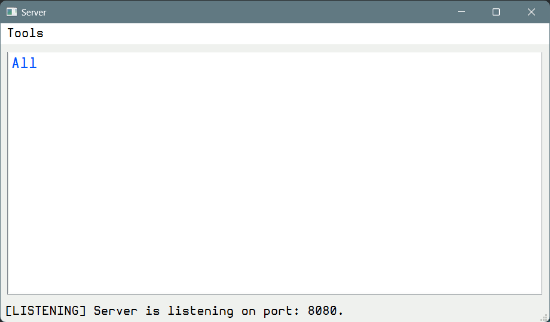

# Malware Project

This project consists of a client-server application designed to simulate malware behavior for educational purposes. The project is divided into two main components: `Malware` and `Malware_Server`.

## Project Structure

The project directory is organized as follows:

```plaintext
.
├── .gitignore
├── Malware/
│   ├── client.cpp
│   ├── client.h
│   ├── clock.cpp
│   ├── clock.h
│   ├── Clock.pro
│   ├── clock.ui
│   ├── main.cpp
├── Malware_Server/
│   ├── main.cpp
│   ├── Malware_Server.pro
│   ├── server.cpp
│   ├── server.h
│   ├── server.ui
│   ├── terminal.cpp
│   ├── terminal.h
│   ├── terminal.ui
├── README.md
```

## Components

### Malware

This directory contains the client-side code.

- **client.cpp**: Implements the client logic, including connecting to the server and handling commands.
- **client.h**: Header file for the client.
- **clock.cpp**: Additional functionality for the client.
- **clock.h**: Header file for the clock functionality.
- **Clock.pro**: Qt project file for the client application.
- **clock.ui**: UI file for the clock application.
- **main.cpp**: Entry point for the client application.

### Malware_Server

This directory contains the server-side code.

- **server.cpp**: Implements the server logic, including handling client connections and commands.
- **server.h**: Header file for the server.
- **terminal.cpp**: Implements terminal-related functionality for the server.
- **terminal.h**: Header file for the terminal functionality.
- **Malware_Server.pro**: Qt project file for the server application.
- **server.ui**: UI file for the server application.
- **terminal.ui**: UI file for the terminal application.
- **main.cpp**: Entry point for the server application.

## Running the Applications

### Downloading the Release

Download the latest release for your operating system from the [GitHub Releases page](https://github.com/danialmd81/malware/releases).

### Running the Server

1. First, run the server:

- **Windows**: Execute `Malware_Server.exe`.
- **Linux**: Execute `Malware_Server.sh`.

### Running the Client

1. After starting the server, run the client:

- **Windows**: Execute `clock.exe`.
- **Linux**: Execute `clock.sh`.


## Demonstration

  To better understand the functionality of the client-server application, you can view the following GIFs demonstrating the malware simulation:

  

  These GIFs provide a visual representation of how the client and server interact in this educational malware simulation.
